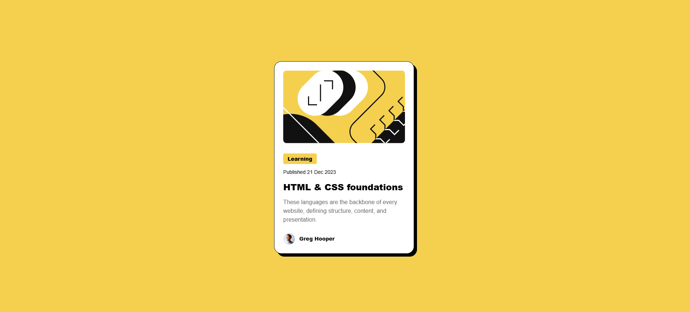

# Frontend Mentor - Blog preview card solution

This is a solution to the [Blog preview card challenge on Frontend Mentor](https://www.frontendmentor.io/challenges/blog-preview-card-ckPaj01IcS). Frontend Mentor challenges help you improve your coding skills by building realistic projects.

## Table of contents

- [Overview](#overview)
  - [The challenge](#the-challenge)
  - [Screenshot](#screenshot)
  - [Links](#links)
- [My process](#my-process)
  - [Built with](#built-with)
  - [What I learned](#what-i-learned)
- [Author](#author)

**Note: Delete this note and update the table of contents based on what sections you keep.**

## Overview

### The challenge

Users should be able to:

- See hover and focus states for all interactive elements on the page

### Screenshot




### Links

- Solution URL: [https://www.frontendmentor.io/solutions/responsive-blog-card-made-with-htmlcss-sS-8onPCeA]
- Live Site URL: [https://davidgasanov.github.io/blog-preview-card/]

## My process

### Built with

- Semantic HTML5 markup
- CSS custom properties
- Flexbox

### What I learned

Learned how to add dynamic font sizes with clamp()

```css
.heading {
  font-size: clamp(20px, 1.5vw, 24px);
  line-height: 150%;
  font-weight: 900;
}
```

## Author

- Frontend Mentor - [@davidGasanov]
